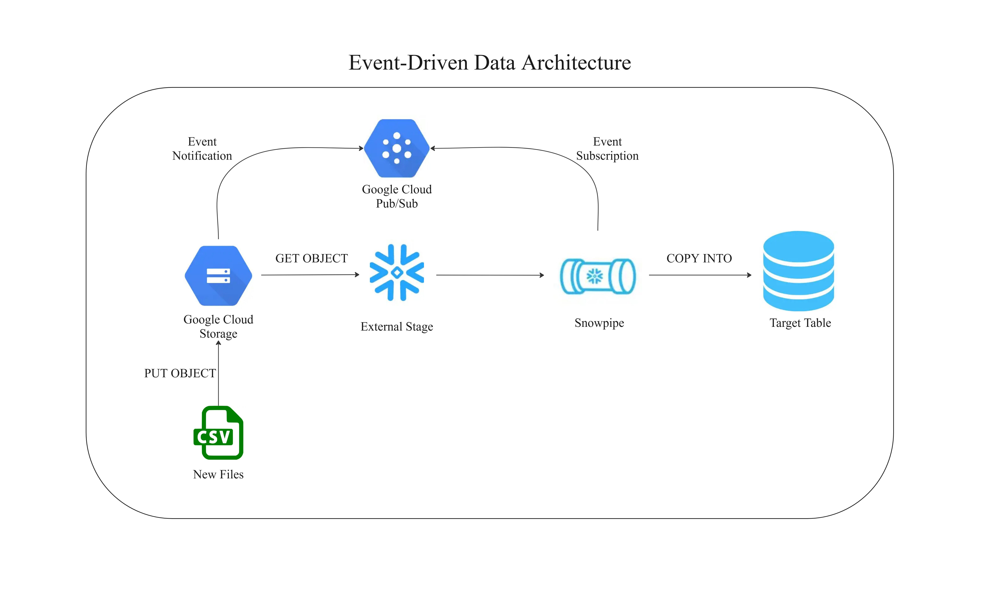

# Event-Driven Data Ingestion Pipeline to Snowflake

This project demonstrates a **cloud-native, event-driven data ingestion pipeline** into Snowflake using **Snowpipe**. The pipeline enables automatic ingestion of raw data files into a Snowflake table as soon as they land in the source cloud storage bucket.

This type of pipeline helps perform **real-time analytics on incoming data** without relying on any third-party ingestion tools. It simplifies architecture by **leveraging native cloud capabilities**, reducing operational overhead, and enabling faster decision-making.

**Supported Sources:**

- **Google Cloud Storage (GCS)** → Uses **Pub/Sub** as the Notification Provider  
- **Azure Data Lake Storage (ADLS)** → Uses **Event Grid**  
- **Amazon S3** → Uses **SNS/SQS**  

**This project uses Google Cloud Storage (GCS) and Google Pub/Sub.**

## Example Use Cases

- Streaming **product licensing logs** into Snowflake for near real-time monitoring  
- Ingesting **IoT device logs** for time-sensitive alerting and predictive maintenance  
- Triggering **security log analysis** and anomaly detection upon file upload  
- Ingesting **e-commerce transactions** for dynamic pricing or inventory updates  
- Enabling **real-time operational decisions** based on live reported field data  

---

## Data Architecture

---

## Objective

To build a simple and scalable event-driven ingestion pipeline to Snowflake where:

- Event files are uploaded to **Google Cloud Storage (GCS)**
- GCS bucket triggers a **Pub/Sub notification**
- **Snowflake Notification Integration** listens to Pub/Sub
- **Snowpipe** copies the file content into a staging table in near real time

---

## 🛠️ Tech Stack

| Layer             | Tools / Services                   |
|------------------|------------------------------------|
| Storage           | Google Cloud Storage (GCS)         |
| Messaging         | Google Cloud Pub/Sub               |
| Ingestion Trigger | Snowflake Notification Integration |
| Data Ingestion    | Snowflake Snowpipe                 |
| Staging Layer     | Snowflake External Stage           |
| Data Warehouse    | Snowflake Table                    |

---

## 📁 Project Structure

📁 sql_scripts/

└──  snowpipe_setup.sql # All Snowflake SQL scripts

📁 readme_assets/

└──  data_architecture.png # Data flow diagram

├── README.md # Project documentation

---

## Getting Started

### ✅ Prerequisites

- A Google Cloud Project with:
  - A GCS bucket (e.g., `data-for-snowpipe`)
  - Pub/Sub API enabled
  - IAM access to manage Pub/Sub and bucket permissions

- A Snowflake account with permissions to:
  - Create **database, schema, and table**
  - Create **Storage and Notification Integrations**
  - Create **Stages** and **Pipes**

- Required GCP IAM Permissions:
  - `storage.buckets.get`, `storage.objects.get`, `storage.objects.list`
  - `monitoring.timeSeries.list`, `roles/pubsub.subscriber`

---

#### 1. Create Snowflake Table Schema

Creates the landing zone table to store raw order data ingested from files landing in the GCS bucket

    create or replace table orders_data_lz (
    order_id int,
    product varchar(20),
    quantity int,
    order_status varchar(30),
    order_date date
    );

#### 2. Create Storage Integration in Snowflake

This command creates a secure storage integration between Snowflake and Google Cloud Storage (GCS)

It authorizes Snowflake to access files only from the specified GCS path

    create or replace storage integration gcs_bucket_read_int
    type = external_stage
    storage_provider = gcs
    enabled = true
    storage_allowed_locations = ('gcs://data_for_snowpipe/');

#### 3. Grant Storage Access to Snowflake Service Account

  - Create custom role in GCP IAM

    - Role Name: GCS_Read_Access

    - Permissions:

      - storage.buckets.get

      - storage.objects.get

      - storage.objects.list

  - Grant access in GCS:

    - Run: `DESC INTEGRATION gcs_bucket_read_int;` to retrieve the service account Snowflake generated.

    - Navigate to GCS bucket → Permissions → Grant Access

    - Add the service account as a Principal

    - Assign the custom role

#### 4. Create External Stage in Snowflake

This command defines a Snowflake stage that references the GCS bucket using the secure storage integration created earlier

    create or replace stage snowpipe_stage
    url = 'gcs://data_for_snowpipe/'
    storage_integration = gcs_bucket_read_int;

#### 5. Create Notification Integration in Snowflake

  - Set up a Pub/Sub topic and subscription in GCP

      - Create a topic: snowpipe_pubsub_topic

      - Add a default subscription

      - Copy the subscription ID

  - Create notification integration:

      This command creates a notification integration with Pub/Sub for triggering Snowpipe upon new file arrival in GCS

          create or replace notification integration notification_from_pubsub_int
          type = queue
          notification_provider = gcp_pubsub
          enabled = true
          gcp_pubsub_subscription_name = 'projects/your-project-id/subscriptions/snowpipe_pubsub_topic-sub';

#### 6. Grant Notification Access in GCP

  - Create custom role: PubSub_Monitoring_Role
      
     - Permission: monitoring.timeSeries.list
   
  - Grant access:

    - Run: `DESC INTEGRATION notification_from_pubsub_int;` to get the Pub/Sub service account.

    - Go to IAM → Grant Access.

    - Add the service account as principal.

    - Assign:

        - Pub/Sub Subscriber

        - PubSub_Monitoring_Role

#### 7. Connect GCS bucket to Pub/Sub topic

  `gsutil notification create -t snowpipe_pubsub_topic -f json gs://data_for_snowpipe/`

  - -t: Topic name

  - -f: Notification format

  - gs://...: GCS bucket name

#### 8. Create Snowpipe to Auto-Ingest

This Snowpipe definition automatically ingests files from the defined stage into the target table whenever new files land in the associated GCS bucket. The   integration enables Snowflake to listen to Pub/Sub notifications and copy data in real time.

    create or replace pipe gcs_to_snowflake_pipe
    auto_ingest = true
    integration = notification_from_pubsub_int
    as
    copy into orders_data_lz
    from @snowpipe_stage
    file_format = (type = 'CSV');

#### 9. Monitor & Debug

View pipe status

    select system$pipe_status('gcs_to_snowflake_pipe');

View ingestion history
    
    select *
    from table(information_schema.copy_history(
    table_name=>'orders_data_lz',
    start_time=>dateadd(hours, -1, current_timestamp())
    ));

---

## 🌟 Learnings & Highlights

  - Created secure integrations between Snowflake and GCP services

  - Enabled automated, near real-time ingestion using Snowpipe

  - Used GCS Notifications + Pub/Sub + Snowflake Notification Integration

  - Implemented IAM best practices via custom roles and least privilege access

  - Streamlined data loading via auto_ingest pipeline

  - Validated ingestion with system views and pipe monitoring

---

### 🔗 Connect With Me

- [LinkedIn](https://www.linkedin.com/in/ishant-kumar-534989233)

🏷️ Tags
#Snowflake #Snowpipe #GCP #DataEngineering #EventDriven #RealTime #CloudStorage #PubSub

